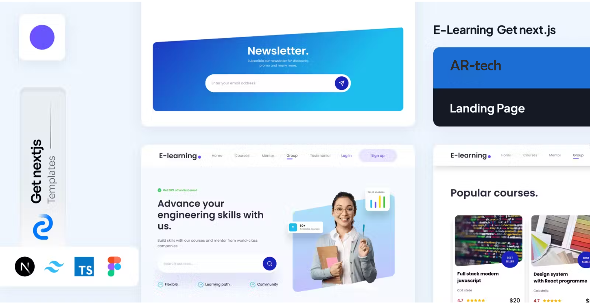
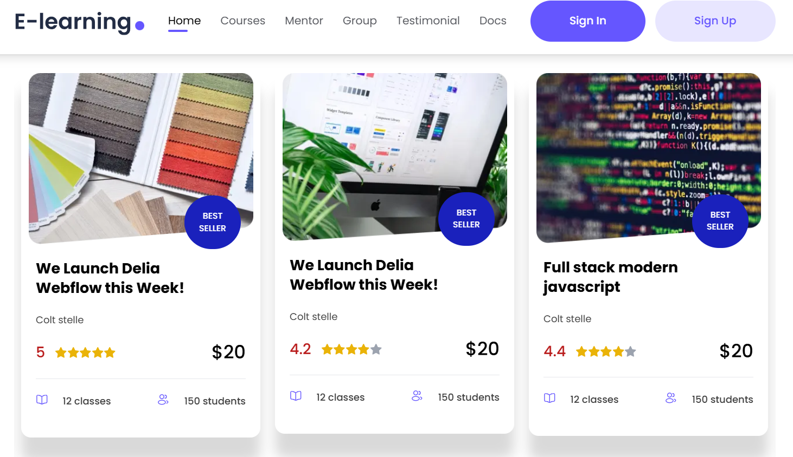

E-Learning Next.js Landing Page Template

🎓 Launch stunning e-learning websites in no time with this FREE Next.js Template!

This developer-friendly template is crafted specifically for e-learning landing pages, empowering you to build professional online course platforms, educational SaaS, or prototypes with ease. Built with modern tools like Next.js 15+, React 18+, TypeScript, and styled with Tailwind CSS, it’s designed to save you time and let you focus on core functionality.

✨ Features

Tailored for E-Learning: Pre-designed components and layouts optimized for online education platforms.

Modern Tech Stack: Built with Next.js 15+, React 18+, and TypeScript for robust, scalable development.

Stylish Design: Styled with Tailwind CSS for a premium, high-end look and feel.

Organized Structure: Clean folder structure and well-organized code for rapid development.

Pre-Built Components: Includes Login/Signup modals, reusable UI elements, and customizable layouts.

Hassle-Free Setup: Get started in minutes with a streamlined setup process.

Fully Customizable: Adapt the template to match your brand with ease.

🚀 Why Use This Template?

Save Time: Skip the boilerplate and jump straight to building core features.

Professional Quality: Premium design that impresses users and enhances engagement.

Developer-Friendly: Clear code structure and TypeScript support make development a breeze.

Open Source & Free: 100% free to use, customize, and deploy for any project.

📸 Screenshots

🛠️ Getting Started

Prerequisites

Node.js (v16 or higher)

npm or Yarn

Basic knowledge of Next.js and TypeScript

Installation

Clone the repository:

git clone [Insert your repository link here]

Navigate to the project directory:

cd elearning-nextjs-template

Install dependencies:

npm install

or

yarn install

Run the development server:

npm run dev

or

yarn dev

Open http://localhost:3000 in your browser to see the template in action!

🎨 Customization

Styling: Modify the Tailwind CSS classes in the styles directory or update the tailwind.config.js file to match your brand’s colors and typography.

Components: Customize pre-built components in the components directory, such as the Login/Signup modals or layout sections.

Content: Update text, images, and branding in the pages and public directories to fit your project.

📂 Folder Structure

elearning-nextjs-template/
├── components/ # Reusable UI components (e.g., Login/Signup modals)
├── pages/ # Next.js pages (e.g., index.tsx for the landing page)
├── public/ # Static assets (images, fonts, etc.)
├── styles/ # Tailwind CSS and global styles
├── types/ # TypeScript type definitions
├── tailwind.config.js # Tailwind CSS configuration
├── next.config.js # Next.js configuration
├── package.json # Project dependencies and scripts
└── README.md # This file

🤝 Contributing

We welcome contributions! To contribute:

Fork the repository.

Create a new branch (git checkout -b feature/your-feature).

Make your changes and commit (git commit -m "Add your feature").

Push to your branch (git push origin feature/your-feature).

Open a Pull Request.

📜 License

This project is licensed under the MIT License. Feel free to use, modify, and distribute it for any purpose.

🔗 Download Now

🙌 Connect with Us

Love this template? Share it with your network! Have feedback or ideas? Drop a comment or reach out to us on [LinkedIn/Twitter/Your Contact]. Let’s build the future of e-learning together!

#NextJS #ReactJS #TypeScript #TailwindCSS #Elearning #WebDevelopment #OpenSource #FreeTemplate #FrontendDev #DevCommunity
