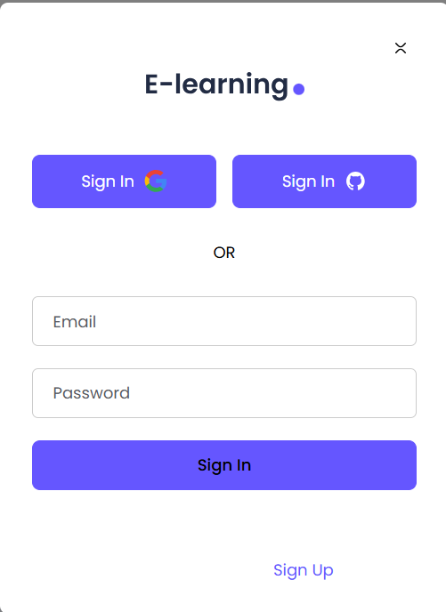

# 

<div align="center">
  
</div>

---

# 🎓 E-Learning Next.js Landing Page Template

Launch high-converting e-learning websites in minutes — **completely FREE** & open-source.

Built for modern devs using **Next.js 15+, React 18+, TypeScript**, and **Tailwind CSS** — it's perfect for online courses, educational SaaS, and MVPs with performance and elegance.

---

## ✨ Features

- 🎯 **Education-Focused Layouts** – Conversion-optimized and clean.
- ⚡ **Modern Stack** – Next.js 15+, React 18+, and TypeScript.
- 🎨 **Polished UI** – Tailwind-powered design with smooth animations.
- 🧩 **Pre-Built Components** – Modals, CTAs, headers, and more.
- 🚀 **Quick Setup** – From clone to launch in minutes.
- 🔧 **Fully Customizable** – Brand it your way.

---

## 🚀 Why Use This Template?

✅ Skip boilerplate  
✅ Professional, responsive design  
✅ Type-safe & developer-friendly  
✅ 100% open source & MIT licensed

---

## 📸 Screenshots

<div align="center">
  
  
  
</div>

---

## 🛠️ Getting Started

### 📦 Prerequisites

- Node.js `v16+`
- npm or Yarn
- Familiarity with Next.js & TypeScript

### ⚙️ Installation

```bash
git clone https://github.com/your-username/elearning-nextjs-template
cd elearning-nextjs-template
npm install   # or yarn install
npm run dev   # or yarn dev
